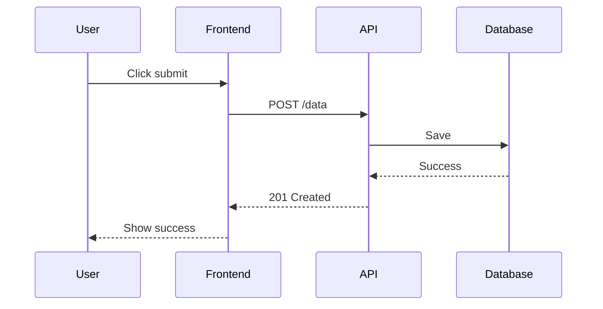

# Spec Writer Reference

Guia para escrita de especificações técnicas.

---

## Estrutura Completa

```markdown
# [Feature Name]

## Metadata
- **Status**: Draft | In Review | Approved
- **Author**: @name
- **Created**: YYYY-MM-DD
- **Updated**: YYYY-MM-DD
- **Target**: YYYY-MM-DD (implementation)

---

## Overview

[2-3 sentences describing what this feature is]

---

## Problem Statement

### Current State
[How things work today]

### Pain Points
[What's wrong with current state]

### Proposed Solution
[High-level approach]

---

## Goals

### Primary Goals
- Goal 1
- Goal 2

### Secondary Goals
- Goal 3
- Goal 4

### Non-Goals
- What we explicitly won't do
- Why these are out of scope

---

## User Stories

**US-1:** As a [user type], I want to [action], so that [benefit]

**Acceptance Criteria:**
- AC-1.1: Given [context], when [action], then [result]
- AC-1.2: Given [context], when [action], then [result]

---

## Technical Design

### Architecture Overview

[Diagram or description of high-level architecture]

```
┌─────────────┐     ┌─────────────┐
│   Frontend  │────▶│   Backend   │
└─────────────┘     └─────────────┘
                           │
                           ▼
                    ┌─────────────┐
                    │  Database   │
                    └─────────────┘
```

### Data Model

[Schema definitions]

```typescript
interface User {
  id: string;
  email: string;
  // ...
}
```

### API Design

| Method | Endpoint | Description | Auth |
|--------|----------|-------------|------|
| GET | /api/users/:id | Get user | Required |
| POST | /api/users | Create user | Admin |

**Request/Response Examples:**

```json
// POST /api/users
// Request
{
  "email": "user@example.com",
  "name": "John Doe"
}

// Response (201)
{
  "id": "usr_123",
  "email": "user@example.com",
  "name": "John Doe",
  "createdAt": "2024-01-15T10:00:00Z"
}
```

### UI/UX Design

[Mockups, wireframes, user flows]

**Key Screens:**
1. Screen 1 - Description
2. Screen 2 - Description

**User Flow:**
```
Start → Step 1 → Step 2 → End
         ↓
       Error State
```

### Security Considerations

- [Auth requirements]
- [Data protection]
- [Input validation]
- [Rate limiting]

### Performance Considerations

- [Expected load]
- [Caching strategy]
- [Database optimization]

---

## Implementation Plan

### Phase 1: Foundation (Week 1)
- [ ] Setup
- [ ] Database migrations
- [ ] API skeleton

### Phase 2: Core (Week 2)
- [ ] Business logic
- [ ] API endpoints
- [ ] Frontend components

### Phase 3: Polish (Week 3)
- [ ] Error handling
- [ ] Testing
- [ ] Documentation

---

## Testing Strategy

### Unit Tests
- Test coverage target: 80%
- Key areas: Business logic, utilities

### Integration Tests
- API endpoints
- Database operations

### E2E Tests
- Critical user flows
- Happy path + error states

### Manual Testing Checklist
- [ ] Feature works as expected
- [ ] Edge cases handled
- [ ] Error states are clear
- [ ] Responsive design

---

## Risks & Mitigations

| Risk | Probability | Impact | Mitigation |
|------|-------------|--------|------------|
| Risk 1 | High | High | Mitigation strategy |
| Risk 2 | Medium | Low | Mitigation strategy |

---

## Open Questions

- [ ] Question 1 (Owner: @name)
- [ ] Question 2 (Owner: @name)

---

## Dependencies

### Upstream
- Feature A must be complete
- API B must be available

### Downstream
- Feature C depends on this
- Team D needs to be notified

---

## References

- [Design doc](link)
- [API documentation](link)
- [Related issue](link)
- [Competitive analysis](link)
```

---

## Writing Tips

### Seja Específico
```markdown
# BAD
The API should be fast.

# GOOD
The API should respond in < 200ms for 95% of requests.
```

### Use Diagramas
```markdown
# Sequence diagram para fluxos complexos

```

### Defina Critérios Mensuráveis
```markdown
# Performance
- API latency: p50 < 100ms, p95 < 200ms, p99 < 500ms
- Page load: < 3s on 3G
- Bundle size: < 100KB gzipped

# Reliability
- Uptime: 99.9%
- Error rate: < 0.1%
```

### Identifique Riscos Cedo
```markdown
# Technical Risks
1. **Third-party API dependency**
   - Probability: Medium
   - Impact: High
   - Mitigation: Implement fallback, cache responses

2. **Database migration complexity**
   - Probability: Low
   - Impact: High
   - Mitigation: Test on staging, have rollback plan
```
