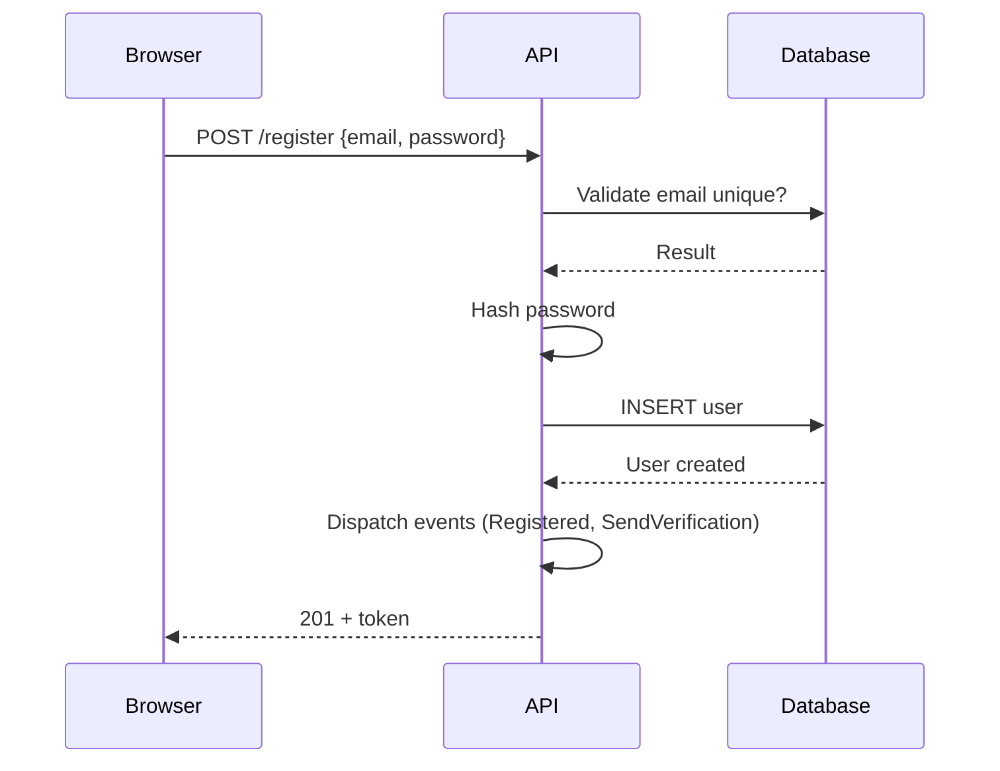

# Templates e Referências - Sprint Management

Templates detalhados, exemplos e estruturas de referência para sprints. Referenciados pelo `SKILL.md` principal.

## Casos de Uso

### Estrutura de um Caso de Uso

```markdown
### UC-XXX: Nome Descritivo

**Como** [papel do usuário: admin, cliente, anônimo...],
**quero** [ação: realizar login, criar pedido...],
**para que** [benefício: acessar o sistema, finalizar compra...].

**Cenário Principal (Happy Path):**
1. Dado [pré-condições: usuário autenticado, dados válidos...]
2. Quando [ação: clica no botão, envia formulário...]
3. Então [resultado: sucesso, redirecionamento, confirmação...]

**Cenários Alternativos:**
- **Caminho Alternativo A:** [descrição]
  - Quando [condição]
  - Então [resultado]

- **Caminho de Exceção:** [descrição do erro]
  - Quando [condição de falha]
  - Então [mensagem de erro / tratamento]

**Regras de Negócio:**
- RN1: [validação obrigatória]
- RN2: [permissão necessária]
- RN3: [limite/restrição]
```

### Boas Práticas

| ✅ Boas Práticas | ❌ Evitar |
|------------------|-----------|
| Focar no valor para o usuário | Listar apenas telas/formulários |
| Descrever o "porquê" | Descrever apenas o "como" técnico |
| Incluir cenários de erro | Considerar apenas happy path |
| Usar linguagem de negócio | Usar jargão técnico |
| Mapear para testes | Deixar testes genéricos |

### Exemplo Completo

```markdown
### UC-001: Registro de Novo Usuário

**Como** visitante do site,
**quero** criar uma conta,
**para que** possa acessar os recursos restritos da aplicação.

**Cenário Principal:**
1. Dado que estou na página de registro
2. Quando preencho nome, email e senha válidos
3. E submeto o formulário
4. Então minha conta é criada
5. E sou redirecionado para o dashboard
6. E recebo um email de confirmação

**Cenários Alternativos:**
- **Email já cadastrado:**
  - Quando o email já existe no sistema
  - Então vejo mensagem "Este email já está cadastrado"
  - E posso solicitar recuperação de senha

- **Campos inválidos:**
  - Quando preencho dados fora do formato esperado
  - Então vejo validação inline em cada campo
  - E o formulário não é submetido

**Cenário de Exceção:**
- **Erro no serviço de email:**
  - Quando o serviço de email está indisponível
  - Então a conta é criada mesmo assim
  - E vejo aviso "Confirmação de email enviada em breve"
  - E um job de email é enfileirado para retry

**Regras de Negócio:**
- RN1: Senha deve ter mínimo 8 caracteres, incluindo maiúscula e número
- RN2: Email deve ser único no sistema
- RN3: Usuário começa com status "pendente" até confirmar email
```

### Mapeamento para Testes

Cada caso de uso deve ter testes correspondentes:

```markdown
## Mapeamento Casos de Uso → Testes

| Caso de Uso | Cenário | Teste | Status |
|-------------|---------|-------|--------|
| UC-001 | Principal | `tests/Feature/Auth/RegisterTest::test_user_can_register` | [x] |
| UC-001 | Email duplicado | `tests/Feature/Auth/RegisterTest::test_cannot_register_with_existing_email` | [x] |
| UC-001 | Validação | `tests/Feature/Auth/RegisterTest::test_validation_fails_with_invalid_data` | [ ] |
| UC-001 | Email down | `tests/Feature/Auth/RegisterTest::test_account_created_when_mail_fails` | [ ] |
```

## Tags e Prioridades

### Tags Disponíveis

| Tag | Descrição | Exemplo |
|-----|-----------|---------|
| `feature` | Nova funcionalidade | Implementar dashboard |
| `bugfix` | Correção de bug | Fixar login incorreto |
| `refactor` | Refatoração de código | Migrar para Actions |
| `chore` | Tarefa rotineira | Atualizar dependências |
| `infra` | Infraestrutura/DevOps | Configurar CI/CD |
| `docs` | Documentação | Atualizar README |
| `security` | Segurança | Corrigir vulnerabilidade |
| `performance` | Performance | Otimizar queries |

### Prioridades

| Nível | Cor | Quando usar |
|-------|-----|-------------|
| Alta | 🔴 | Bloqueia outros sprints, urgente |
| Média | 🟡 | Importante mas não urgente |
| Baixa | 🟢 | Nice to have, pode esperar |

## Definition of Done (DoD)

### Critérios de Aceitação

Todo sprint deve atender aos seguintes critérios para ser considerado "Concluído":

```markdown
## Critérios de Aceitação (DoD)

### Código
- [ ] Todos os testes passando (`php artisan test --compact`)
- [ ] Cobertura de testes mínima de 80%
- [ ] Code review aprovado por pelo menos 1 pessoa
- [ ] Pint passando sem erros (`vendor/bin/pint`)
- [ ] Insights/PHPStan sem erros críticos

### Qualidade
- [ ] Sem warnings/deprecations no log
- [ ] Sem vulnerabilities de segurança
- [ ] Performance validada (sem N+1, queries otimizadas)
- [ ] Código seguindo padrões do projeto

### Documentação
- [ ] README atualizado se necessário
- [ ] Novos recursos documentados
- [ ] Alterações de breaking change documentadas
- [ ] Comentários em código complexo

### Deploy
- [ ] Migrations aplicadas em staging
- [ ] Testes manuais realizados em staging
- [ ] Deploy em staging realizado com sucesso
- [ ] Rollback testado e documentado

### Processo
- [ ] Branch atualizada com main/master
- [ ] Merge request/PR criado e aprovado
- [ ] Tarefas do sprint todas marcadas [x]
- [ ] Tracking.md atualizado
```

### Definition of Ready (DoR)

Critérios para um sprint iniciar:

```markdown
## Critérios de Prontidão (DoR)

### Planejamento
- [ ] Objetivo claro e mensurável
- [ ] Casos de uso definidos
- [ ] Tarefas estimadas
- [ ] Dependências identificadas

### Recursos
- [ ] Stakeholder disponível para dúvidas
- [ ] Ambiente de desenvolvimento configurado
- [ ] Acesso a serviços externos (APIs, etc.)

### Visão
- [ ] Mockup/design aprovado (se frontend)
- [ ] Contratos de API definidos (se integração)
- [ ] Modelo de dados validado
```

### Checklist Automático de DoD

```markdown
## Status DoD
| Categoria | Itens | Concluídos | % |
|-----------|-------|------------|---|
| Código | 5 | 3 | 60% |
| Qualidade | 4 | 4 | 100% |
| Documentação | 4 | 2 | 50% |
| Deploy | 4 | 0 | 0% |
| Processo | 4 | 4 | 100% |
| **TOTAL** | **21** | **13** | **62%** |

**Sprint pronto para merge?** ❌ Não - Faltam: deploy em staging
```

## Bloqueios e Riscos

### Acompanhamento de Bloqueios

```markdown
## Bloqueios Atuais

| Bloqueio | Impacto | Ação | Responsável | Desde |
|----------|---------|------|-------------|-------|
| API externa X está down | Alto | Contatar time X | @joao | 2026-02-20 |
| Falta definição do design | Médio | Reunião com design | @maria | 2026-02-21 |

**Total de bloqueios**: 2 (1 Alto, 1 Médio)
```

### Riscos Identificados

```markdown
## Riscos

| Risco                | Probabilidade | Impacto | Mitigação | Status |
|----------------------|---------------|---------|-----------|--------|
| Atraso na integração | Alta | Alto | Criar mock da API | ⚠️ Ativo |
| Mudança de requisito | Média | Médio | Reunião alinhamento | ✅ Mitigado |
| Falha de performance | Baixa | Alto | Load testing antes | 📋 Planejado |
```

### Matriz de Riscos
```markdown
Alto Impacto │ Baixa Probabilidade │ Alta Probabilidade
─────────────┼─────────────────────┼────────────────────
             │                     │
   Alto      │  Planejar           │  Prioritário
             │                     │
─────────────┼─────────────────────┼────────────────────
             │                     │
   Baixo     │  Aceitar            │  Monitorar
             │                     │
─────────────┴─────────────────────┴────────────────────
             Baixa            Alta
              Probabilidade
```

## Rastreamento TDD

### Ciclo Red-Green-Refactor por Tarefa

```markdown
## Rastreamento TDD

| Tarefa | Teste Criado? | Código? | Passando? | Refatorado? | Status |
|--------|---------------|---------|-----------|-------------|--------|
| Criar Model User | [x] | [x] | [x] | [x] | ✅ |
| Criar UserController | [x] | [x] | [ ] | [ ] | ⏳ |
| Adicionar validação | [x] | [ ] | [ ] | [ ] | 🔴 |

**Legenda**:
- [x] = Concluído
- [ ] = Pendente
- 🔴 = Falhando (testes vermelhos)
- ⏳ = Em andamento
- ✅ = Completo
```

### Checklist TDD por Tarefa

```markdown
### Tarefa: Criar Model User

**Estado atual**: 🟢 Green

#### Checklist
- [ ] **RED**: Escrever teste falhando
  - [ ] Definir comportamento esperado
  - [ ] Executar e confirmar falha
- [ ] **GREEN**: Fazer passar
  - [ ] Implementar código mínimo
  - [ ] Executar e confirmar sucesso
- [ ] **REFACTOR**: Melhorar código
  - [ ] Extrair métodos
  - [ ] Renomear variáveis
  - [ ] Remover duplicação
  - [ ] Testes ainda passando?

#### Testes Cobertos
- `tests/Unit/Models/UserTest::test_user_can_be_created`
- `tests/Unit/Models/UserTest::test_user_requires_email`
```

### Resumo de Cobertura

```markdown
## Cobertura de Testes

| Tipo | Planejado | Escrito | Passando | % |
|------|-----------|---------|----------|---|
| Unit | 10 | 8 | 8 | 80% |
| Feature | 5 | 3 | 2 | 40% |
| Browser | 2 | 0 | 0 | 0% |
| **TOTAL** | **17** | **11** | **10** | **59%** |

**Cobertura de código**: 67%
**Meta mínima**: 80%
```

## Detalhamento Técnico

### Blueprint de Models e Banco de Dados

```markdown
## Estrutura de Dados

### Model: User

```php
// app/Models/User.php
class User extends Authenticatable
{
    protected $fillable = [
        'name',
        'email',
        'password',
        'role', // admin, user, manager
        'status', // active, inactive, suspended
    ];

    protected $casts = [
        'email_verified_at' => 'datetime',
        'password' => 'hashed',
    ];

    // Relacionamentos
    public function posts()
    {
        return $this->hasMany(Post::class);
    }

    public function teams()
    {
        return $this->belongsToMany(Team::class);
    }
}
```

### Migration: create_users_table

```php
// database/migrations/2024_02_10_000001_create_users_table.php
return new class extends Migration
{
    public function up(): void
    {
        Schema::create('users', function (Blueprint $table) {
            $table->id();
            $table->string('name');
            $table->string('email')->unique();
            $table->string('password');
            $table->enum('role', ['admin', 'user', 'manager'])->default('user');
            $table->enum('status', ['active', 'inactive', 'suspended'])->default('active');
            $table->timestamp('email_verified_at')->nullable();
            $table->rememberToken();
            $table->timestamps();

            $table->index(['email', 'status']);
        });
    }
};
```

### Tabela: users

| Coluna | Tipo | Nullable | Default | Índice |
|--------|------|----------|---------|--------|
| id | bigint | NO | AUTO_INCREMENT | PK |
| name | varchar(255) | NO | - | - |
| email | varchar(255) | NO | - | UNIQUE |
| password | varchar(255) | NO | - | - |
| role | enum | NO | 'user' | - |
| status | enum | NO | 'active' | - |
| email_verified_at | timestamp | YES | NULL | - |
| created_at | timestamp | NO | CURRENT_TIMESTAMP | - |
| updated_at | timestamp | NO | CURRENT_TIMESTAMP | - |
```

### Contratos de API

```markdown
## API Endpoints

### POST /api/auth/register
Registro de novo usuário.

**Request:**
```json
{
  "name": "João Silva",
  "email": "joao@example.com",
  "password": "Secret@123",
  "password_confirmation": "Secret@123"
}
```

**Response 201:**
```json
{
  "data": {
    "id": 1,
    "name": "João Silva",
    "email": "joao@example.com",
    "role": "user",
    "status": "active"
  },
  "token": "eyJ0eXAiOiJKV1QiLCJhbGc..."
}
```

**Response 422:**
```json
{
  "message": "Validation failed",
  "errors": {
    "email": ["The email has already been taken."],
    "password": ["The password must be at least 8 characters."]
  }
}
```

### GET /api/users
Lista usuários com paginação.

**Query Params:**

| Param | Tipo | Default | Descrição |
|-------|------|---------|-----------|
| page | int | 1 | Número da página |
| per_page | int | 15 | Itens por página (max 100) |
| search | string | - | Busca por nome ou email |
| status | enum | - | Filtrar por status |
| sort | string | name | Campo para ordenação |
| order | asc|desc | asc | Direção da ordenação |

**Request:**
```
GET /api/users?page=1&per_page=20&status=active&sort=name&order=asc
```

**Response 200:**
```json
{
  "data": [
    {
      "id": 1,
      "name": "João Silva",
      "email": "joao@example.com",
      "role": "user",
      "status": "active",
      "created_at": "2024-02-10T10:30:00Z"
    }
  ],
  "meta": {
    "current_page": 1,
    "per_page": 20,
    "total": 45,
    "last_page": 3
  },
  "links": {
    "first": "...",
    "last": "...",
    "prev": null,
    "next": "..."
  }
}
```
```

### Mockups e Wireframes

```markdown
## Telas/Componentes

### Tela de Login
**Layout**: Centralizado, card com sombra
**Campos**:
- Email (input type="email", required)
- Senha (input type="password", com toggle de visibilidade)
- Link "Esqueci minha senha"
- Botão "Entrar" (primário, desabilitado até validação)
- Link "Não tem conta? Cadastre-se"

**Estados**:
- `initial`: Campos vazios, botão desabilitado
- `typing`: Validação em tempo real, feedback visual
- `error`: Mensagens de erro em vermelho abaixo dos campos
- `loading`: Botão com spinner, texto "Entrando..."
- `success`: Redireciona para /dashboard
```

### Componente: UserCard
```tsx
// resources/js/Components/Users/UserCard.tsx
interface UserCardProps {
  user: {
    id: number;
    name: string;
    email: string;
    avatar?: string;
    role: 'admin' | 'user' | 'manager';
    status: 'active' | 'inactive' | 'suspended';
  };
  onEdit?: (id: number) => void;
  onDelete?: (id: number) => void;
}

export function UserCard({ user, onEdit, onDelete }: UserCardProps) {
  return (
    <div className="bg-white rounded-lg shadow p-4">
      {/* Implementation */}
    </div>
  );
}
```
```

### Diagramas de Sequência



### Exemplos de Teste

```markdown
## Testes de Referência

### Feature Test: Register User
```php
// tests/Feature/Auth/RegisterTest.php
test('user can register with valid data', function () {
    $response = $this->postJson('/api/auth/register', [
        'name' => 'João Silva',
        'email' => 'joao@example.com',
        'password' => 'Secret@123',
        'password_confirmation' => 'Secret@123',
    ]);

    $response->assertStatus(201)
        ->assertJsonPath('data.email', 'joao@example.com')
        ->assertJsonPath('data.role', 'user')
        ->assertJsonStructure([
            'data' => ['id', 'name', 'email', 'role'],
            'token',
        ]);

    $this->assertDatabaseHas('users', [
        'email' => 'joao@example.com',
        'role' => 'user',
        'status' => 'active',
    ]);
});

test('cannot register with existing email', function () {
    User::factory()->create(['email' => 'joao@example.com']);

    $response = $this->postJson('/api/auth/register', [
        'name' => 'Outro Nome',
        'email' => 'joao@example.com',
        'password' => 'Secret@123',
        'password_confirmation' => 'Secret@123',
    ]);

    $response->assertStatus(422)
        ->assertJsonValidationErrors(['email']);
});

test('password must meet security requirements', function () {
    $response = $this->postJson('/api/auth/register', [
        'name' => 'João Silva',
        'email' => 'joao@example.com',
        'password' => '123', // Too short, no uppercase
        'password_confirmation' => '123',
    ]);

    $response->assertStatus(422)
        ->assertJsonValidationErrors(['password']);
});
```
```

## Template Padrão de Sprint

```markdown
# Sprint XXX: Nome Descritivo

## Status
**Status**: Planejado 📋

## Metadados
- **Prioridade**: 🟡 Média
- **Complexidade**: 5 pontos
- **Tags**: feature, backend
- **Depende de**: [XXX-sprint-anterior.md]
- **Branch Git**: feature/sprint-XXX-nome
- **Stakeholder**: @responsável

## Descrição
Descrição detalhada do objetivo deste sprint.

## Requisitos
- Requisito 1
- Requisito 2

## Casos de Uso

### UC-001: Nome do Caso de Uso

**Como** [ator/papel],
**quero** [ação/funcionalidade],
**para que** [benefício/valor].

**Cenário Principal:**
1. Dado [pré-condição]
2. Quando [ação/gatilho]
3. Então [resultado esperado]

**Cenários Alternativos:**
- **Caminho Alternativo A:** [descrição]
  - Quando [condição alternativa]
  - Então [resultado alternativo]

- **Caminho de Exceção:** [descrição]
  - Quando [condição de erro]
  - Então [tratamento de erro/mensagem]

**Regras de Negócio:**
- RN1: [regra]
- RN2: [regra]

## Estrutura de Dados
```php
// app/Models/...
// database/migrations/...
```

## API Endpoints (se aplicável)
```
METHOD /endpoint
Descrição
Request/Response
```

## Telas/Componentes (se frontend)
```
Descrição ou mockup
```

## Fluxos de Integração
```
Diagrama de sequência ou fluxo
```

## Implementação

### Tarefas
- [ ] Tarefa 1
- [ ] Tarefa 2

### Alterações
- **Backend**:
  - `app/Models/...`
  - `database/migrations/...`

- **Frontend**:
  - `resources/js/Pages/...`
  - `resources/views/...`

## Testes
- [ ] Testes unitários
- [ ] Testes de feature
- [ ] Testes de browser

## Rastreamento TDD
| Tarefa | Teste Criado? | Código? | Passando? | Refatorado? | Status |
|--------|---------------|---------|-----------|-------------|--------|
| Tarefa 1 | [ ] | [ ] | [ ] | [ ] | 🔴 |
| Tarefa 2 | [ ] | [ ] | [ ] | [ ] | 🔴 |

## Mapeamento Casos de Uso → Testes
| Caso de Uso | Cenário | Teste | Status |
|-------------|---------|-------|--------|
| UC-001 | Principal | `tests/Feature/...` | [ ] |
| UC-001 | Exceção | `tests/Feature/...` | [ ] |

## Bloqueios Atuais
*Nenhum bloqueio no momento*

## Riscos
| Risco | Probabilidade | Impacto | Mitigação | Status |
|-------|---------------|---------|-----------|--------|
| [risco] | [Alta/Média/Baixa] | [Alto/Médio/Baixo] | [ação] | 📋 |

## Critérios de Aceitação (DoD)

### Código
- [ ] Todos os testes passando (`php artisan test --compact`)
- [ ] Cobertura mínima de 80%
- [ ] Code review aprovado
- [ ] Pint passando (`vendor/bin/pint`)
- [ ] Insights sem erros críticos

### Qualidade
- [ ] Sem warnings/deprecations
- [ ] Sem vulnerabilities
- [ ] Performance validada

### Documentação
- [ ] Atualizada se necessário

### Deploy
- [ ] Migrations aplicadas (staging)
- [ ] Deploy em staging realizado

## Notas
Notas adicionais sobre implementação.
```

## Template de Sprint com Blueprint

```markdown
# Sprint XXX: Nome Descritivo

## Status
**Status**: Planejado 📋

## Metadados
- **Prioridade**: 🟡 Média
- **Complexidade**: 8 pontos (Blueprint complexo)
- **Tags**: feature, backend, filament
- **Depende de**: [XXX-sprint-anterior.md]
- **Branch Git**: feature/sprint-XXX-nome
- **Stakeholder**: @responsável

## Descrição
Descrição detalhada do objetivo deste sprint.

## Blueprint
**Arquivo**: `sprints/XXX-nome-do-sprint/blueprints/blueprint.yaml`

Este sprint usa Filament Blueprint para gerar:
- [ ] Modelos e migrations
- [ ] Resources Filament
- [ ] Relacionamentos
- [ ] Formulários

### Comandos Blueprint
```bash
# Gerar código a partir do blueprint
php artisan blueprint:build sprints/XXX-nome-do-sprint/blueprints/blueprint.yaml

# Gerar e aplicar migrations
php artisan blueprint:build sprints/XXX-nome-do-sprint/blueprints/blueprint.yaml --migrate
```

### Estrutura Gerada
Após executar o blueprint:
- Modelos em `app/Models/`
- Migrations em `database/migrations/`
- Resources em `app/Filament/Resources/`
- Factories em `database/factories/`

## Requisitos
- Requisito 1
- Requisito 2

## Casos de Uso

### UC-001: Nome do Caso de Uso

**Como** [ator],
**quero** [ação],
**para que** [benefício].

**Cenário Principal:**
1. Dado [pré-condição]
2. Quando [ação]
3. Então [resultado]

**Cenários Alternativos:**
- **Alternativa A:** Quando [condição], então [resultado]
- **Exceção:** Quando [erro], então [tratamento]

**Regras de Negócio:**
- RN1: [regra]

## Implementação

### 1. Preparação
- [ ] Revisar blueprint.yaml
- [ ] Ajustar campos/relacionamentos se necessário
- [ ] Executar `php artisan blueprint:build`

### 2. Tarefas
- [ ] Tarefa 1
- [ ] Tarefa 2

### 3. Alterações Manuais (se necessário)
- **Backend**:
  - `app/Models/...`
  - `database/migrations/...`

- **Frontend**:
  - `resources/js/Pages/...`
  - `resources/views/...`

## Testes
- [ ] Testes unitários
- [ ] Testes de feature
- [ ] Testes de browser
- [ ] Testes de Resources Filament

## Rastreamento TDD
| Tarefa | Teste Criado? | Código? | Passando? | Refatorado? | Status |
|--------|---------------|---------|-----------|-------------|--------|
| Criar blueprint | [x] | [x] | [x] | [ ] | ⏳ |
| Tarefa 1 | [ ] | [ ] | [ ] | [ ] | 🔴 |

## Mapeamento Casos de Uso → Testes
| Caso de Uso | Teste | Status |
|-------------|-------|--------|
| UC-001 | `tests/Feature/...` | [ ] |

## Bloqueios Atuais
*Nenhum bloqueio no momento*

## Riscos
| Risco | Probabilidade | Impacto | Mitigação | Status |
|-------|---------------|---------|-----------|--------|
| Blueprint gera código incorreto | Média | Alto | Revisar gerado | 📋 |

## Critérios de Aceitação (DoD)

### Código
- [ ] Todos os testes passando
- [ ] Cobertura mínima de 80%
- [ ] Code review aprovado

### Blueprint
- [ ] Blueprint validado
- [ ] Código gerado revisado
- [ ] Ajustes manuais feitos

### Deploy
- [ ] Migrations aplicadas (staging)
- [ ] Deploy em staging realizado

## Notas
Notas adicionais sobre implementação.
```

## Template de Sprint Gerado pelo Brainstorm

Template completo usado quando um sprint é criado após o brainstorm interativo:

```markdown
# Sprint XXX: Nome Descritivo

## Status
**Status**: Planejado 📋
**Data Criação**: [data atual]

## Metadados
- **Prioridade**: [definido no brainstorm]
- **Complexidade**: [X pontos estimados]
- **Tags**: [definidas no brainstorm]
- **Depende de**: [XXX-sprints.md se houver]
- **Branch Git**: feature/sprint-XXX-nome
- **Stakeholder**: @[responsável]

## Descrição
[Descrição detalhada do objetivo]

## Problema de Negócio
**Dor do usuário**: [descrito no brainstorm]
**Valor de negócio**: [descrito no brainstorm]
**Métricas de sucesso**: [descrito no brainstorm]

## Requisitos
- REQ-001: [requisito funcional]
- REQ-002: [requisito funcional]
- NFR-001: [requisito não-funcional: performance, segurança, etc]

## Casos de Uso
[Com UC-001, UC-002, etc. com cenários completos]

## Estrutura de Dados
[Models, migrations, relacionamentos - código PHP real]

## API Endpoints / Routes
[Contratos completos de request/response]

## Telas/Componentes
[Mockups ou descrição detalhada]

## Arquitetura
### Services / Actions
- `App\Actions\CreateOrder`
- `App\Actions\ProcessPayment`

### Jobs / Events
- `OrderCreated` → `SendOrderConfirmationEmail`
- `ProcessPayment` (queue)

### Policies
- `OrderPolicy` (view, update, delete, cancel)

## Implementação
[Lista de tarefas]

## Rastreamento TDD
[Tabela TDD]

## Mapeamento Casos de Uso → Testes
[Tabela de mapeamento]

## Bloqueios Atuais
*Nenhum bloqueio no momento*

## Riscos
[Tabela de riscos identificada no brainstorm]

## Critérios de Aceitação (DoD)
[Checklist completo]

## Notas
[Notas adicionais sobre decisões arquiteturais, trade-offs, etc.]
```

## Relatórios

### Template de Relatório Executivo

```markdown
## Relatório Executivo

### Sprint 001: Autenticação de Usuários
**Status**: Concluído ✅
**Período**: 2026-02-10 → 2026-02-15 (5 dias)

#### Resumo
| Métrica | Valor |
|---------|-------|
| Tarefas planejadas | 12 |
| Tarefas concluídas | 12 |
| Taxa de conclusão | 100% |
| Testes criados | 15 |
| Cobertura | 87% |
| Pontos estimados | 8 |
| Pontos realizados | 8 |
| Velocidade | 1.6 pontos/dia |

#### Casos de Uso Implementados
- UC-001: Registro de usuário ✅
- UC-002: Login com email/senha ✅
- UC-003: Recuperação de senha ✅

#### Destaques
✅ **Pontos Fortes**: Todos os testes passando, boa cobertura
⚠️ **Atenção**: 2 dias de atraso devido a bug em lib externa

#### Próximos Passos
- Sprint 002: Perfil de usuário
- Sprint 003: Roles e permissões
```

### Template de Relatório de Múltiplos Sprints

```markdown
## Relatório de Progresso - Fev 2026

### Visão Geral
| Métrica | Valor |
|---------|-------|
| Sprints concluídos | 4 |
| Sprints em andamento | 1 |
| Sprints planejados | 3 |
| Tarefas concluídas | 47 |
| Taxa geral de conclusão | 89% |
| Velocidade média | 1.4 pontos/dia |

### Sprints por Status

#### Concluídos ✅
- [001-autenticacao](sprints/001-autenticacao.md) - 100% (8/8 tarefas)
- [002-perfil](sprints/002-perfil.md) - 100% (12/12 tarefas)
- [003-roles](sprints/003-roles.md) - 100% (10/10 tarefas)
- [004-dashboard](sprints/004-dashboard.md) - 100% (17/17 tarefas)

#### Em Andamento 🚧
- [005-relatorios](sprints/005-relatorios.md) - 60% (6/10 tarefas) ⚠️ Bloqueado

#### Planejados 📋
- [006-notificacoes](sprints/006-notificacoes.md) - 0% (0/8 tarefas)
- [007-api-publica](sprints/007-api-publica.md) - 0% (0/15 tarefas)
- [008-integracoes](sprints/008-integracoes.md) - 0% (0/12 tarefas)

### Tendências
- 📈 Velocidade aumentando: 1.2 → 1.6 pontos/dia
- 📉 Taxa de bugs em produção: 3 → 1 por semana
- ✅ Cobertura de testes estável: ~85%
```

### Exportar Relatório

```markdown
## Opções de Exportação

### Markdown
```bash
# Exportar para MD
cat > relatorio-sprint-001.md << 'EOF'
[conteúdo do relatório]
EOF
```

### JSON (para integrações)
```json
{
  "sprint": "001-autenticacao",
  "status": "Concluído",
  "metricas": {
    "tarefas_planejadas": 12,
    "tarefas_concluidas": 12,
    "taxa_conclusao": 100,
    "cobertura_testes": 87,
    "dias_duracao": 5
  },
  "casos_de_uso": [
    {"id": "UC-001", "nome": "Registro", "status": "concluido"},
    {"id": "UC-002", "nome": "Login", "status": "concluido"}
  ]
}
```

### Compartilhar
```bash
# Copiar para clipboard (Linux)
xclip -selection clipboard < relatorio-sprint-001.md

# Abrir em editor
code relatorio-sprint-001.md
```
```
```
